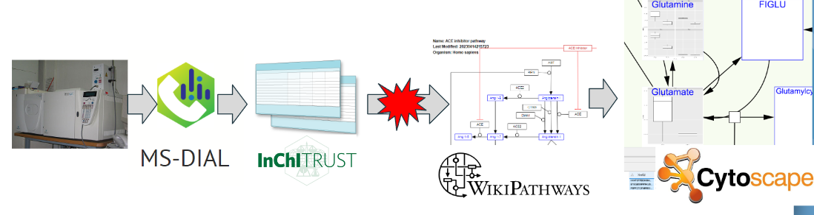

# Background

Targeted and non-targeted metabolomic analysis using mass spectrometry is used to understand metabolic processes taking place in a wide variety of organisms, from prokaryotes, plants, and fungi to animals and humans.
Non-targeted approaches allow us to detect as many metabolites as possible at once, find significant metabolic changes among them, and perform new characterizations of metabolites in biological samples.
However, biological interpretation of large, complex data sets, such as those in non-target approaches, is difficult using metabolomics analysis alone (i.e., quantification of metabolites in samples).
The foremost approach to address that challenge would be data integration, which projects the quantitative values of the aforementioned metabolites onto a network of biochemicals (called as pathway).

Metabolome raw data are quantified using preprocessing software such as MS-DIAL [@tsugawa2020lipidome] and data for peak annotation called "library".
Most of the metadata in the library contains InChIKey [@heller2015inchi], and an information infrastructure that serves as an ID bridge between InChIKey and pathways is necessary for data integration between metabolome quantification values and pathways.

|  | 
|:--:| 
| *Figure 1. Graphical Abstract. In this section we will be presenting the id mapping difficulty between metabolome and pathway to interpret metabolomics data.* |

WikiPathways [@martens2021wikipathways] is one of the major pathway databases and has a Cytoscape [@shannon2003cytoscape] App [@kutmon2014wikipathways],
which can import the pathway into Cytoscape and help visualization and interpretation of the omics data on the pathway.
However, the data resource for metabolites in WikiPathways is not limited to one, and multiple IDs may be mixed in one pathway.
Furthermore, InChIKey is not the main ID.

```
select str(?datasource) as ?source count(distinct ?identifier) as ?count
where {
  ?mb a wp:Metabolite ;
    dc:source ?datasource ;
    dc:identifier ?identifier .
} order by desc(?count)
```


Therefore, a system to align the IDs of scattered namespaces in a pathway into InChIKey is needed for Metabolomics.
It is possible to achieve the ID alignment in WikiPathways SPARQL endpoint (https://sparql.wikipathways.org/) by using a federated query, but at present the query is difficult to write, slow performance.
There is also an id conversion system called BridgeDB [@van2010bridgedb] in the WikiPathways ecosystem, but the BridgeDB is not involved the WikiPathways SPARQL endpoint.

# Outcomes

To achieve our objectives, we conducted a comprehensive survey of open source language models available and evaluated their suitability for our task. We explored different models, taking into consideration factors such as performance, computational requirements, and ease of deployment. Subsequently, we sought to run the selected models on a local computer, ensuring that the infrastructure requirements were met.

Having established a working environment for LLMs, we developed a set of pipelines that incorporated various natural language processing techniques to extract relevant biological terms from textual data. These terms were then matched and mapped to the corresponding ontology terms, thereby providing a standardized representation of the extracted information. By utilizing Linked Data principles, we aimed to create an interconnected network of biological knowledge that would facilitate data integration and enable advanced analysis.


# Future work

Moving forward, there are several areas of potential future work to enhance our project's linked data standardization with LLMs. First, exploring advanced LLMs and optimizing computational efficiency can improve performance. Additionally, expanding ontology mapping to cover more domains and integrating external data sources would increase the scope of our standardization efforts. Validating and evaluating results against gold-standard datasets, involving domain experts, and developing a user-friendly interface for researchers to interact with the pipelines are crucial next steps. These future endeavors will refine and advance our methodology, increasing its impact and adoption in bioinformatics.

## Acknowledgements

We would like to thank the fellow participants at BioHackathon 2023 for their collaboration and constructive advice, which greatly influenced our project. We are grateful to the organizers for providing this platform and the developers of open source language models. Special thanks to our mentors, advisors, and colleagues for their guidance and support. Without their contributions, our project in linked data standardization with LLMs in bioinformatics would not have been possible.

## References

1. This will be automatically generated.
